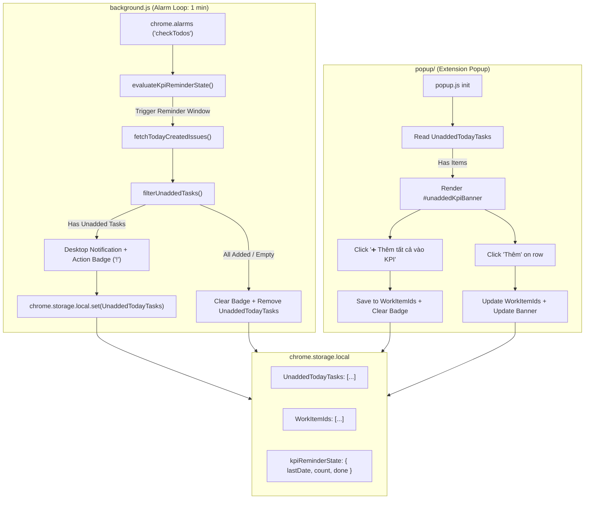

# Design Specification: End-of-Day Unadded WorkItems Warning Subsystem

**Date:** 2026-10-01  
**Status:** Validated & Ready for Review  
**Target:** Extension Service Worker (`background.js`), Popup UI (`popup/`), Shared Utilities (`utils.js`), Test Suites  

---

## 1. Overview & Problem Statement

Developers frequently create tasks and work items during their daily sprint on GitLab. Towards the end of the day, before checking out, developers often forget to add newly created work items to their KPI tracking list (`WorkItemIds` in extension storage). This leads to inaccurate daily logs, missing estimates, and distorted monthly KPI performance reports.

This subsystem introduces an **End-of-Day Automated Warning & 1-Click Sync Engine** that:
1. Operates on workdays, evaluating current time against the user's configured `checkOutTime` (e.g. `18:00`).
2. Triggers an automated scan **X minutes before check-out** (default 15 minutes, e.g. at `17:45`).
3. Queries the GitLab REST API for all work items/issues authored by the user created **today** (`created_at >= 00:00:00` local time).
4. Diffing against already-tracked tasks in `WorkItemIds`.
5. If untracked tasks are discovered:
   - Dispatches a system Desktop Notification with direct action routing.
   - Displays an amber warning badge (`!`) on the browser extension icon.
   - Renders a high-visibility, expandable warning banner in `popup/popup.html` with **"➕ Thêm tất cả vào KPI"** (1-click batch add) and individual item add buttons.

---

## 2. Requirements & Acceptance Criteria

### Functional Requirements
- **FR-1 (Date Isolation)**: The scanner MUST strictly filter tasks created today (`created_at >= 00:00:00` local time). It MUST NOT retrieve or flag historical/backlog issues created on previous dates.
- **FR-2 (User Authorship & State)**: The scanner MUST query work items authored/opened by the authenticated user (`scope=created_by_me` / `author = currentUser`) that are currently in `state = opened`.
- **FR-3 (Deduplication & Diffing)**: The system MUST compare fetched API tasks against `WorkItemIds` in `chrome.storage.local` using normalized IID/ID/URL matching (via `isTaskInList`).
- **FR-4 (Configurable Timing)**:
  - Users can enable/disable the feature (`kpiReminderEnabled`, default: `true`).
  - Users can configure the warning lead time before checkout (`kpiReminderMinutesBefore`, default: `15` minutes).
- **FR-5 (Desktop Notification & Badge)**:
  - Dispatches `kpi-unadded-alert` notification when untracked tasks are found at the target reminder window.
  - Clicking the notification opens the extension popup or brings focus to the action UI.
  - Sets browser action badge: text `'!'` with warning background `#f59e0b`.
- **FR-6 (Popup Warning Banner)**:
  - Renders `#unaddedKpiBanner` when `UnaddedTodayTasks` contains items.
  - Displays summary headline (e.g., *"⚠️ Bạn có 2 task tạo hôm nay chưa thêm vào KPI"*).
  - Includes a prominent **"➕ Thêm tất cả vào KPI"** button that immediately persists all items to `WorkItemIds`, clears the banner, removes the badge, and triggers cross-tab sync.
  - Expandable task list allowing individual additions.
  - Automatically hides when all tasks are added.

### Non-Functional Requirements
- **NFR-1 (Manifest V3 CSP)**: 100% compliant. Pure local scripts, no remote CDNs, no eval/inline script handlers.
- **NFR-2 (Network Resiliency)**: Handles missing access tokens, expired tokens, or offline connectivity gracefully without throwing unhandled rejections or freezing the service worker.
- **NFR-3 (Anti-Spam)**: Ensures notifications are dispatched only once per day (or rate-limited via snooze) to avoid desktop alert spam.

---

## 3. System Architecture & Components



### Component Details

#### 1. `utils.js` (Pure Helpers & Utilities)
- `getTodayStartIso(now = new Date())`:
  Calculates local midnight (`00:00:00.000`) for the provided date and formats it as an ISO 8601 string (`YYYY-MM-DDTHH:mm:ss.sssZ`).
- `filterUnaddedTasks(apiIssues, storedWorkItems)`:
  Filters `apiIssues` to only include items not present in `storedWorkItems` using `isTaskInList(storedWorkItems, issue)`.
- `evaluateKpiReminderState(now, settings, state)`:
  Pure state evaluation function (similar to `evaluateAlertState` for check-in/out). Returns `{ shouldScan, shouldNotify, nextState }`.
  - Checks `isWorkday(now)`.
  - Calculates reminder trigger time: `checkOutTime - kpiReminderMinutesBefore`.
  - Resets on day boundary (`lastDate !== today`).
  - Guards against repeated spam (max 2 alerts per day).

#### 2. `background.js` (Service Worker)
- In the alarm handler for `checkTodos`:
  - Calls `checkUnaddedKpiTasksReminder()`.
  - Reads `AccessToken`, `checkOutTime`, `checkOutEnabled`, `kpiReminderEnabled`, `kpiReminderMinutesBefore`, `kpiReminderState`.
  - If `evaluateKpiReminderState` triggers:
    - Queries GitLab REST API: `${origin}/api/v4/issues?scope=created_by_me&state=opened&created_after=${todayStartIso}&per_page=100`.
    - Diffs with `WorkItemIds`.
    - Updates storage `UnaddedTodayTasks` and badge text/color.
    - Sends desktop notification `kpi-unadded-alert` if untracked tasks exist.
- In `handleNotificationClick`:
  - If `notifId === 'kpi-unadded-alert'`, clears notification and opens extension popup (or navigates to page view).

#### 3. `popup/popup.html` & `popup/popup.css` & `popup/popup.js`
- **DOM**:
  `<div id="unaddedKpiBanner" class="unadded-kpi-banner" style="display: none;">` placed right above the tab navigation.
  Contains:
  - Header: Warning icon, count, and headline.
  - Action buttons: `#addAllUnaddedKpiBtn` ("➕ Thêm tất cả vào KPI"), `#toggleUnaddedListBtn` ("Chi tiết ▼").
  - Container `#unaddedKpiItemsList` for task cards.
- **CSS**:
  Amber theme with high visual contrast, rounded corners (8px), comfortable typography, responsive micro-buttons.
- **JS**:
  - `renderUnaddedKpiBanner(tasks)`: renders banner with task items.
  - Handlers for batch-add and individual add.
  - Storage change listener updating banner when tasks are added from any tab.
- **Settings**:
  - In `#settings-tab` or Check-in/out section: Adds toggle `#kpiReminderEnabledInput` and number input `#kpiReminderMinutesInput` (default 15).

---

## 4. Storage Data Contracts

```typescript
interface UnaddedTask {
    id: string;              // e.g. "2067"
    iid: string;             // e.g. "2067"
    title: string;           // Issue/task title
    href: string;            // Web URL to task on GitLab
    createdAt: string;       // ISO date string
    parentTitle?: string;    // Associated parent title if available
    parentUrl?: string;      // Associated parent URL if available
    parentIid?: string;      // Associated parent IID if available
}

interface KpiReminderSettings {
    kpiReminderEnabled: boolean;       // default: true
    kpiReminderMinutesBefore: number;  // default: 15
    checkOutTime: string;              // e.g. "18:00"
}

interface KpiReminderState {
    lastDate: string;        // "YYYY-MM-DD"
    count: number;           // Number of notifications dispatched today
    done: boolean;           // True if user dismissed or resolved
    lastNotified: string;    // ISO timestamp
}
```

---

## 5. Verification Plan

### Automated Test Suite: `scratch/test_unadded_tasks_warning.js`
1. `getTodayStartIso`: Verifies exact midnight start calculation across timezones.
2. `filterUnaddedTasks`:
   - Exact ID, numeric IID, and URL path matching against `storedWorkItems`.
   - Empty list, null list, and full match scenarios.
3. `evaluateKpiReminderState`:
   - Weekend vs weekday evaluation.
   - Pre-reminder window (no alert).
   - In-reminder window (triggers alert).
   - Post-checkout / already resolved state.
4. API Fetch & Storage Diff Simulation:
   - Mock fetch response from `/api/v4/issues`.
   - Populates `UnaddedTodayTasks` and clears when resolved.
5. Popup UI & Event Handlers:
   - Banner rendering logic.
   - Batch-add event execution.
   - Badge clearing logic.

### Full Pipeline Integration
- Register `scratch/test_unadded_tasks_warning.js` as Suite 10 in `scratch/test_full_suite.js`.
- Execute `node -c` syntax checks across all JS files.
- Verify CSP compliance across all HTML files.
